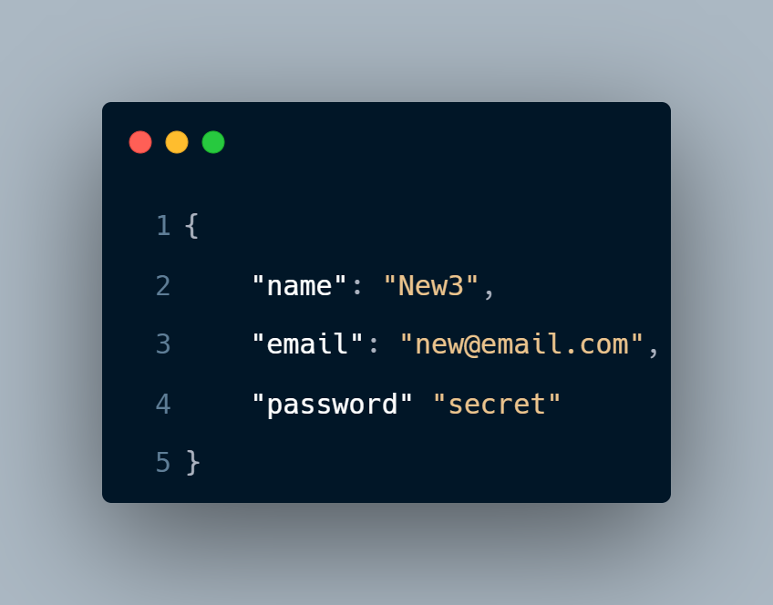
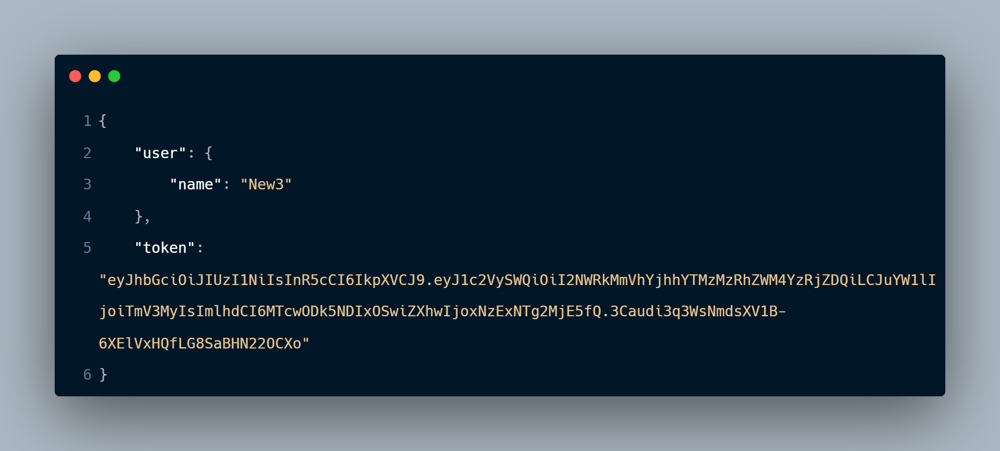
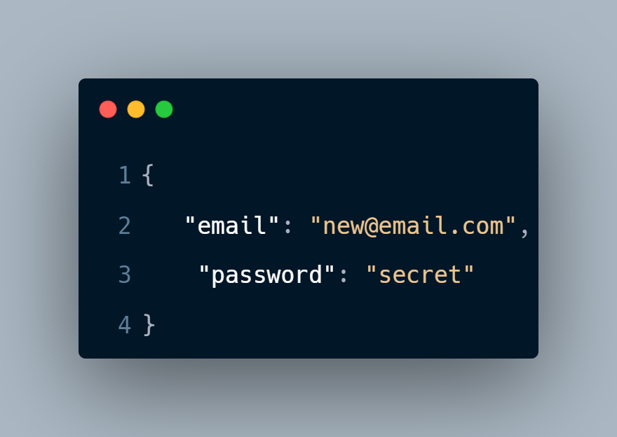
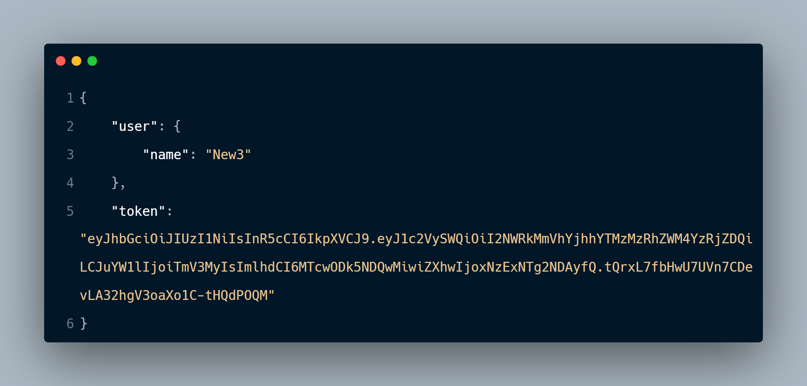
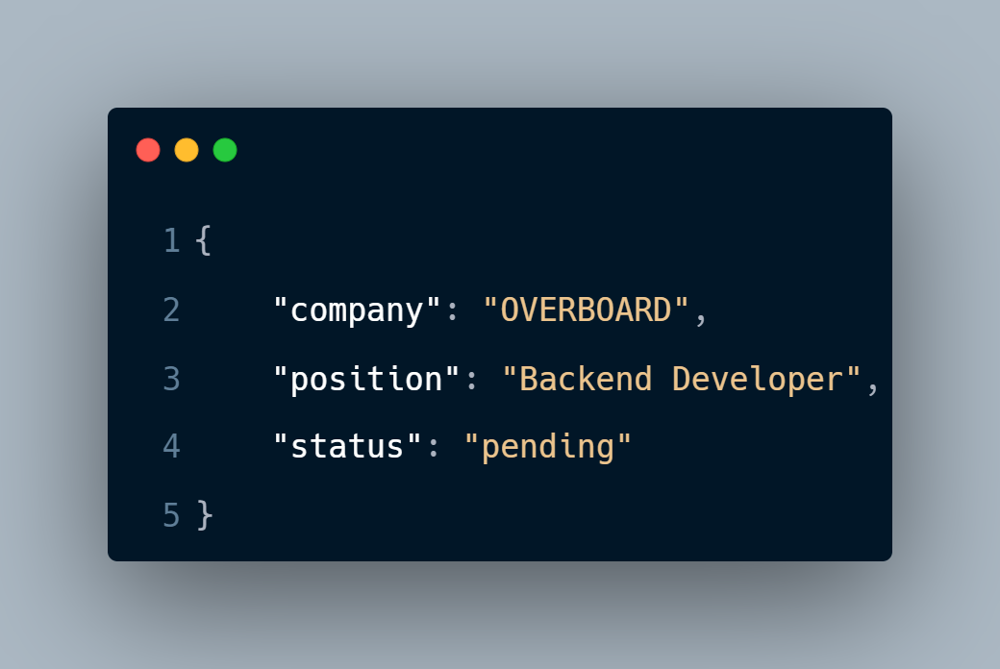
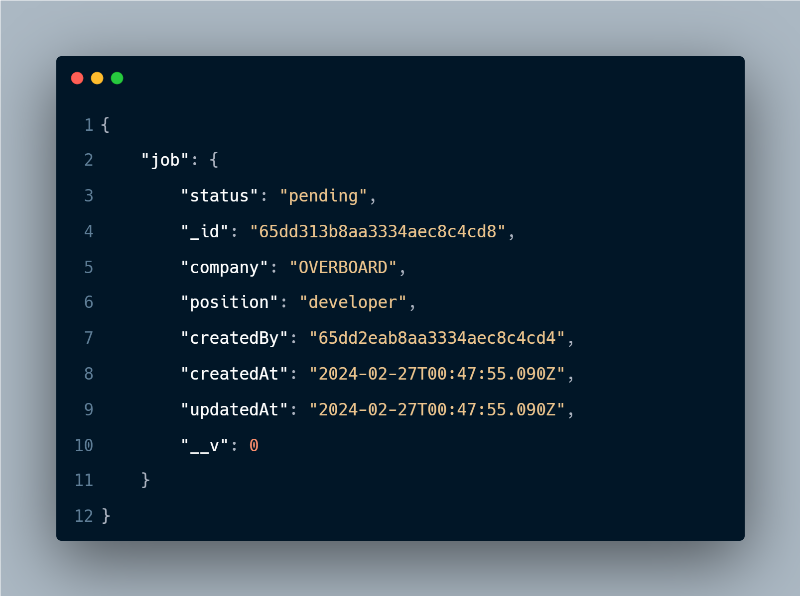
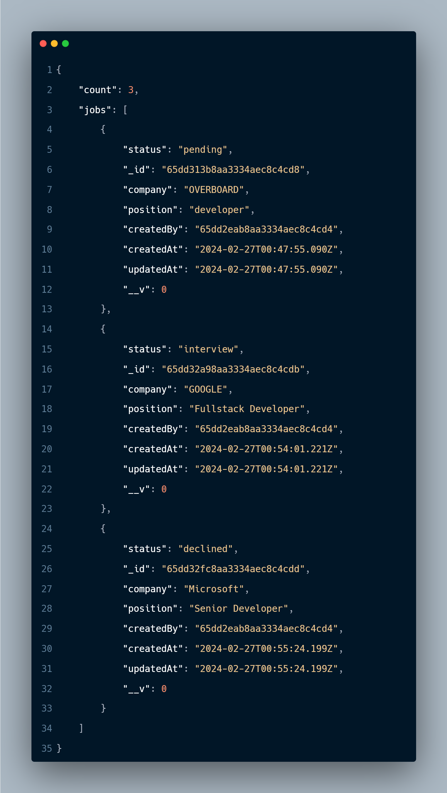
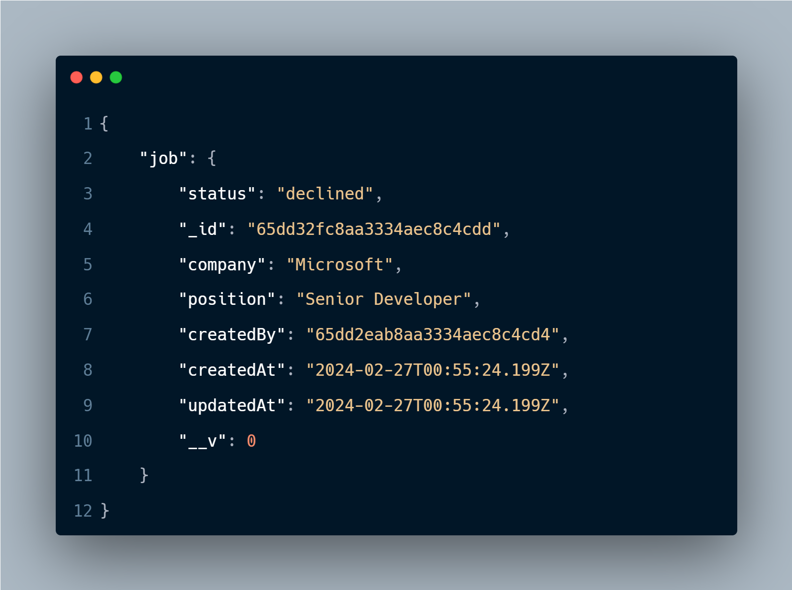
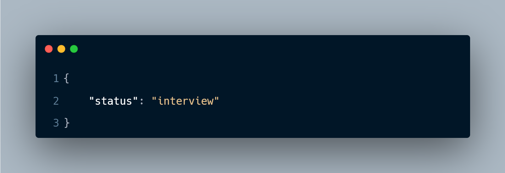

<div style="text-align: center;">
  <h1>Jobs API</h1>
</div>


This is a Job Api built with Node.js and Express. It allows users to manage their daily job search by creating, reading, updating, and deleting jobs. Users can also register and login to the application.

## Hosting

This API is currently hosted [Live Here](https://jobs-api-bnvf.onrender.com).


## Table of Contents

- [Setup](#setup)
- [Features](#features)
- [Endpoints](#endpoints)
- [Usage](#usage)
- [Status Codes](#status-codes)
- [Response Format](#response-format)
- [Error Handling](#error-handling)
- [Dependencies](#dependencies)
- [Contributing](#contributing)

## Setup

1. Clone the repository:

    ```bash
    git clone https://github.com/Olusegun-Light/Jobs-API
    cd jobs-api
    ```

2. Install dependencies:

    ```bash
    npm install
    ```

3. Set up environment variables:

    ```bash
    PORT=3000
    MONGO_URI=<your_mongodb_connection_string>
    JWT_SECRET=<your_jwt_secret_key>
    JWT_LIFETIME=<token_lifetime>
    ```

4. Start the server:

    ```bash 
    npm start
    ```

## Features

- User authentication (register, login)
- CRUD operations for managing jobs (create, read, update, delete)
- Authentication middleware for protecting job routes
- Error handling middleware for managing various error types

## Endpoints

#### Register a new user.

```http
  POST  /api/v1/auth/register
```

| Parameter | Type     | Description                |
| :-------- | :------- | :------------------------- |
| `name` | `string` | **Required**.  |
| `email` | `string` | **Required**.  |
| `password` | `string` | **Required**.  |

##### Request


##### Response
##### `201 CREATED`



#### Login an existing user.

```http
  POST  /api/v1/auth/login
```

| Parameter | Type     | Description                |
| :-------- | :------- | :------------------------- |
| `email` | `string` | **Required**.  |
| `password` | `string` | **Required**.  |

##### Request



##### Response
##### `200 OK`


#### Create a new job.

```http
  POST  /api/v1/jobs
```

| Parameter | Type     | Description                |
| :-------- | :------- | :------------------------- |
| `company` | `string` | **Required**.  |
| `position` | `string` | **Required**.  |
| `status` | `string` |   

##### Request



##### Response
##### `201 CREATED`


#### Get all jobs created by the authenticated user.

```http
  GET  /api/v1/jobs
```

##### Response
##### `200 OK`


#### Get a specific job by ID.

```http
  GET  /api/v1/jobs/:id
```

##### Response
##### `200 OK`



#### Update a job by ID.

```http
  PUT  /api/v1/jobs/:id
```

| Parameter | Type     | 
| :-------- | :------- | 
| `company` | `string` |   
| `position` | `string` |  
| `status` | `string` |

##### Request


##### Response
##### `200 OK`


#### Delete a job by ID.

```http
  DELETE  /api/v1/jobs/:id
```

##### Response
##### `200 OK`


## Status Codes

The following status codes are used by the API:

| Code  | Title     | Description                |
| :-------- | :------- | :------------------------- |
| `200` | `OK` | The request was successful.  |
| `201` | `Created` | A new resource was created.  |
| `400` | `ad Request` | The request was invalid.  |
| `401` | `Unauthorized` | The user is not authorized to access the resource.  |
| `404` | `Not Found` | The resource could not be found.  |
| `500` | `Internal Server Error` | An unexpected error occurred.  |

## Response Format

The API responses are in JSON format. The response structure will vary depending on the endpoint, but it will typically include the following properties:

- **statusCode:** The HTTP status code.
- **message:** A human-readable message describing the outcome of the request.
- **data:** An object containing the requested data (e.g., a list of jobs, a specific job).


## Error Handling

The API handles various types of errors including validation errors, authentication errors, not found errors, and internal server errors. The error messages are descriptive and informative.

## Dependencies

- `express`: Web framework for Node.js
- `mongoose`: MongoDB object modeling tool
- `bcryptjs`: Library for hashing passwords
- `jsonwebtoken`: JSON Web Token implementation
- `http-status-codes`: Library for HTTP status codes
- `helmet`: Middleware for securing Express apps
- `cors`: Middleware for enabling CORS
- `xss-clean`: Middleware for preventing cross-site scripting attacks
- `express-rate-limit`: Middleware for rate limiting requests
- `swagger-ui-express`: Middleware for serving Swagger UI
- `yamljs`: Library for parsing YAML files
- `dotenv`: Library for loading environment variables from a `.env` file

## Tech Stack

**Server:** NodeJs, ExpressJs, MongoDDB

## Contributing

Pull requests are welcome. If you encounter any problem with the app or server, you can open an issue.

If you liked this project, don't forget to leave a star 🌟.


## Documentation


